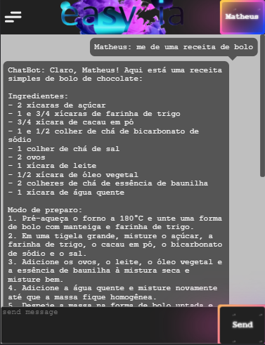

---

LINK PROJECT : https://matheusrelvinhas.github.io/easy-ia/

  

Clique no botão user e coloque seu nome e key, a key é gerada clicando no link, faço login e gere um key.
Nessa aplicação react.js eu usei a api do chatGPT com funcionalidades que ela mesma tem , porém não estão como padrão, como exemplo quantidade de respostas, contexto, frenquência, presença, tokens e temperatura, todas essas funcionalidades fazem o chatGPT ter novas funcionalidades e respostas diversificadas.

  

